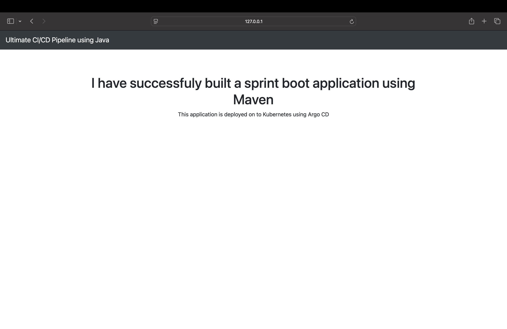
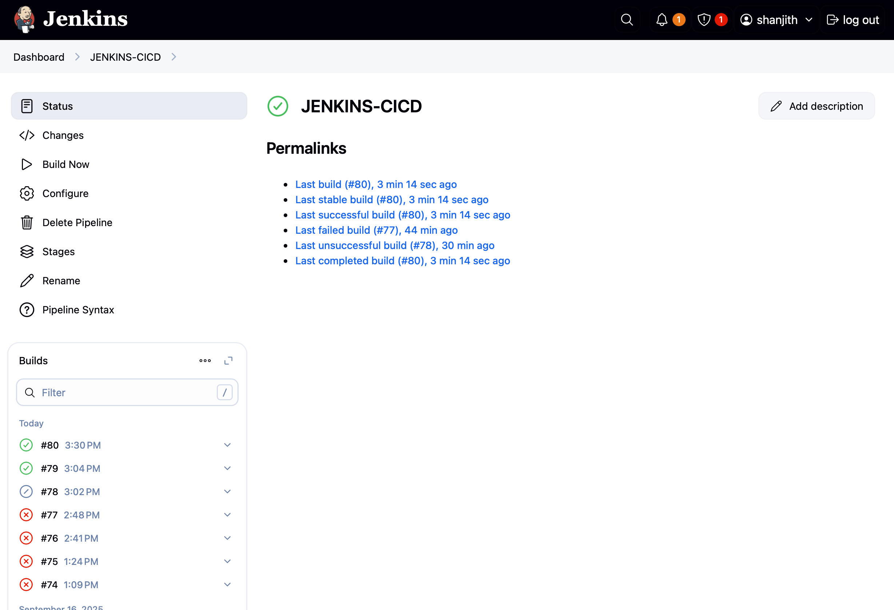
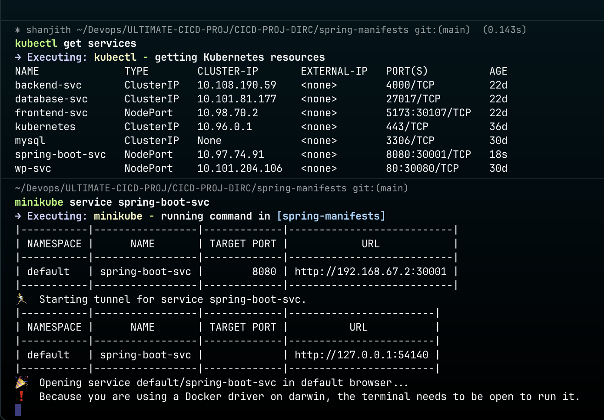
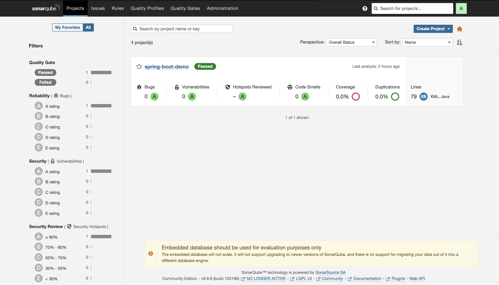
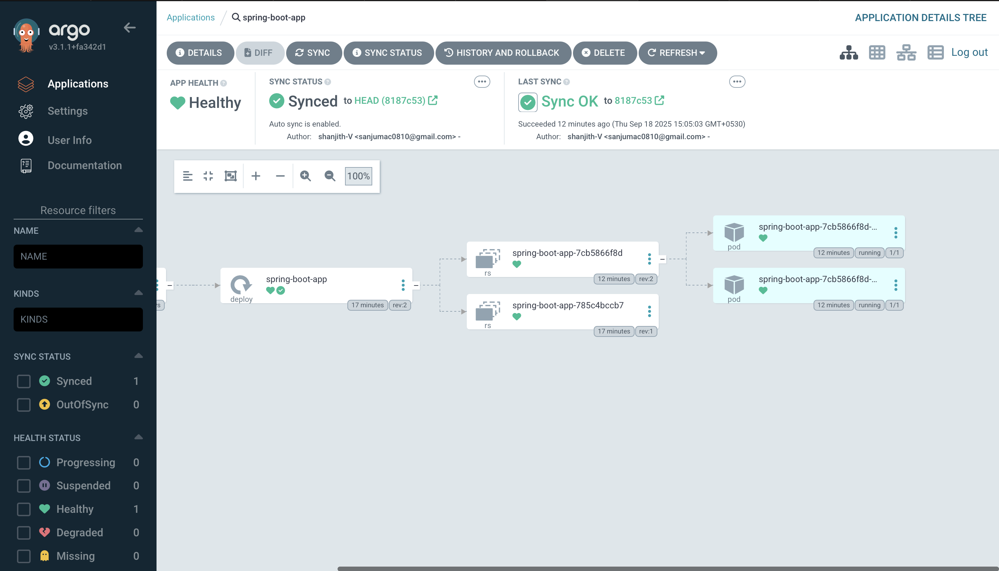

# CI/CD Pipeline for Maven Application with Jenkins, SonarQube, Docker, and ArgoCD

This project demonstrates a complete CI/CD pipeline for a Maven-based Spring Boot application.  
The pipeline is built using **Jenkins** and integrates with **SonarQube**, **Docker Hub**, **GitHub**, and **Kubernetes (via ArgoCD)**.

---

## Pipeline Overview

1. **Code Quality Check**  
   - Source code is analyzed with **SonarQube** running on `http://localhost:9000`.

2. **Build & Package**  
   - Maven is used to build and package the Spring Boot application into a JAR file.

3. **Docker Image Build & Push**  
   - A Docker image is created for the application.  
   - The image is pushed to **Docker Hub** for containerized deployment.

4. **Push Manifests to GitHub**  
   - Kubernetes manifests are updated in a GitHub repository to trigger deployment with ArgoCD.

5. **Deployment with ArgoCD**  
   - ArgoCD (running locally on `https://localhost:8082`) watches the GitHub repository and syncs changes to the Kubernetes cluster.  
   - The application is deployed to **Minikube** (local Kubernetes).

6. **Service Exposure**  
   - The application is exposed to external traffic via a **NodePort Service**.

---

## Tools & Technologies Used

- **Jenkins** – CI/CD automation server (`http://localhost:8080`)  
- **SonarQube** – Static code analysis (`http://localhost:9000`)  
- **Maven** – Java application build tool  
- **Docker & Docker Hub** – Containerization and image registry  
- **GitHub** – Version control and manifest storage  
- **ArgoCD** – GitOps-based continuous deployment (`https://localhost:8082`)  
- **Kubernetes (Minikube)** – Application orchestration  

---

## Project Workflow

```text
Developer Commit → Jenkins (localhost:8080) → SonarQube (localhost:9000) → Maven Build → Docker Build → Docker Hub
        ↓
   Update Manifests on GitHub → ArgoCD (localhost:8082) → Kubernetes Deployment → NodePort Service
```
---
## projects outputs:






---


